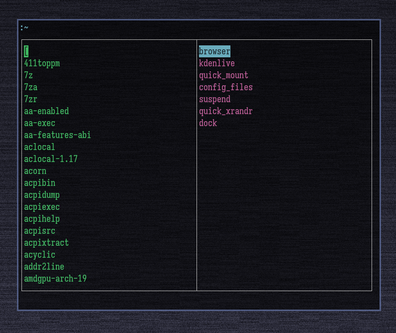

This is a ncurses menu program it is controlled by alt tab to switch columns and scales to window
size. Page up and Page down work as expected. Tab is auto complete. I wrote this read me as quick
as possible. Later it will be updated. 
Also mouse control double click selects enter completes.
 
 
Example: 
seq 1 2000 | ./nmenu -p -c a b c -c 1 2 3 

-t: changes the title 
-p: enables pipe input 
-preserve: preserves the pipe column while tabbing around 
-direct_input: allows the user to enter incomplete strings 
-no_translit: disables anyaskii transliteration 
-0: Changes deliminator to null terminator 
-dl: Sets a custom deliminator 
-m: enables multicolumn output I think its seperated by enters 
-split: seperates columns based on a deliminator and displays the index based on the number 
-c: is used to seperate columns 1 2 3 
./nmenu -c 1 2 3 
1 
2 
3 
./nmenu -c 1 2 3 -c a b c 
1 | a 
2 | b 
3 | c 
-c1 I think this is to disable the formatting 

